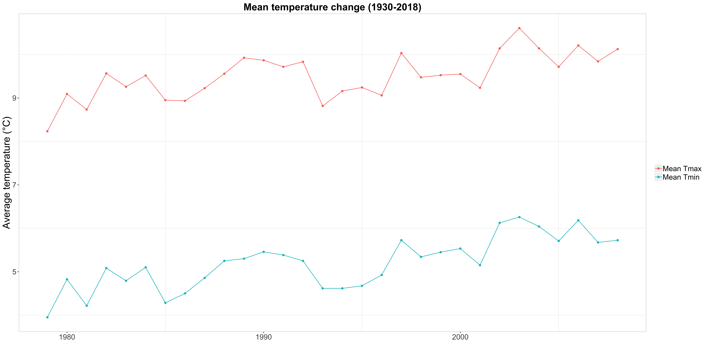

## Write your dissertation in Rmarkdown

*Created by Anna*

### Tutorial Aims

1. Understanding the advantages of using `Rmarkdown` for writing pdf documents, focusing on writing your dissertation;

2. Learning how to create the template for the main page, and appending all the other sections to it;

3. Using LaTex for embellishing the pdf output and functioning as a supplement to Markdown; 

4. Becoming familiar with `knitr` and `kableExtra` packages. 

### Steps:

<a href="#section1"> 1. The "main" Rmarkdown document.</a>

<a href="#subsect1"><sub>a) The front page.</sub></a>

<a href="#subsect2"><sub>b) The abstract.</sub></a>

<a href="#toc"> 2. Table Of Contents (TOC).</a>

<a href="#section2"> 3. "Child" documents.</a>

<a href="#subsect3"><sub> Example: the Appendix.</sub></a>

<a href="#section4"> 4. Let's merge!</a>

<a href="#section5"> 5. Final tips. </a>

--------------------------------------------


<a name="section1"></a>

## 1. The "main" Rmarkdown document. 

When you write a document, whether it's an essay, or a scientific report, or your undergraduate dissertation, it is going to be structured in different sections. 

In the scientific world, these sections consist of: an introduction, methods, results, discussion, and a list of your references. If we consider a published paper or a thesis, these also contain an abstract, perhaps a section with abbreviations, and at the end present a section with supplementary information, or an appendix. 

As the aim of this tutorial is to successfully write your dissertation with Rmarkdown, it is useful to consider the number of sections necessary for your output, and to *avoid writing everything in one single .Rmd document*. 

In fact, for sake of easier read and better organisation, but also faster upload of the final pdf, we are going to create multiple .Rmd files, corresponding to the main sections of the dissertation. We are then going to merge them together, within the "mother" document. 

So, first thing we are going to do is create the main .Rmd file. 
Here, we are going to set the first page of your dissertation and we are going to **link** all the other .Rmd documents containing the different sections. 
In this file, we are also going to set the general formatting rules (written in **LaTex**), which are going to apply to the entire document.

**Open Rstudio and create a new .Rmd file** by clicking on the blank sheet with the green plus one the left-hand side of the interface. 


Once you have created a new Rmarkdown document, leave title and author blank (you don't want these to appear at the top of your pdf) and select PDF as the Default Output Format. Click OK and let's start writing in the new file.


You will see at the top a section called **YAML header**, delimited by three hyphens (---). The header embeds the information that you have just given (blank for the title, no author and pdf_document as your desired output), and allows you to set the rules that are going to be applied throught the document (as well as the **linked** documents). This header will not show in the output. 

The School of Geosciences provides standard formatting rules for the undergraduate dissertation document, and we are going to set the file according to them (these are as of 2020, if they have changed edit them accordingly). 

Now we need to add more details and specifications to our **YAML header** to apply to the entire to document (and its 'child' documents). 

````
---
title: " "
output:
  pdf_document:
    number_sections: TRUE
geometry: "left = 2.5cm, right = 2cm, top = 2cm, bottom = 2cm"
fontsize: 11pt
header-includes:
  - \usepackage{float}
  - \usepackage{sectsty}
  - \usepackage{paralist}
  - \usepackage{setspace}\spacing{1.5}
  - \usepackage{fancyhdr}
  - \usepackage{lastpage}
  - \usepackage{dcolumn}
---
````

- **number_sections: TRUE** will automatically create sections that ordered according to the type of header (main, sub-, etc.); 

- **geometry**: sets margin sides for pdf output (according to School of Geosciences guidelines); 

- **fontsize**: sets entire font throughout document to be 11 pt. You can change that in the file for specific sections of your choosing; 

- **header-includes**: allows you to specify all the **LaTex** packages you are going to need in your file. In this way, you can keep all the specifics inside your main .Rmd document and they **will apply to the child documents, too**. 

The packages include: 

- [float](https://ctan.mirror.garr.it/mirrors/ctan/macros/latex/contrib/float/float.pdf): improves the interface for defining *floating objects*, like figures and tables; 

- [sectsty](http://www.ctex.org/documents/packages/layout/sectsty.pdf): helps you change the style of any or all LaTex *sectional headers* in the article, book or report classes. Examples include the addition of rules above or below a section title; 

- [paralist](https://ctan.mirror.garr.it/mirrors/ctan/macros/latex/contrib/paralist/paralist.pdf): provides enumerate and itemise environments that can be used within paragraphs to format the items as either *running text* or as *separate paragraphs with preceding number or symbol*; 

- [setspace](https://www.ctan.org/pkg/setspace): provides support for *setting spacing between lines* in a document. Options include \singlespacing, \onehalfspacing and \doublespacing commands (which we'll see below). As you can see, I've already set the general rule to be 1.5 spacing (as per university guidelines); 

- [fancyhdr](https://ctan.mirror.garr.it/mirrors/ctan/macros/latex/contrib/fancyhdr/fancyhdr.pdf): the package provides extensive facilities, both for *constructing headers and footers, and for controlling their use*; 

- [lastpage](https://ctan.mirror.garr.it/mirrors/ctan/macros/latex/contrib/lastpage/lastpage.pdf): *references the number of pages *in your LaTex document through the introduction of a new label; 

- [dcolumn](https://ctan.mirror.garr.it/mirrors/ctan/macros/latex/required/tools/dcolumn.pdf): makes use of the "array" package to define a *"D" column* for use in tabular environments. 


Below the first code chunk (already present from the start of the document), write the following. 

````
\allsectionsfont{\centering}
\subsectionfont{\raggedright}
\subsubsectionfont{\raggedright}

\pagenumbering{gobble} 
````

The **\allsectionsfont** command specifies changes to your header font - in this case to have them centered. Instead, we have specified **\subsectionfont** and **\subsubsectionfont** (for sub-headers) to be ragged right.  

**\pagenumbering{gobble}**, instead, **does not print any page number**, and this is ideal for the moment, as we are about to create the front page, which does not require one. Remember though, **gobble** option in the **pagenumbering** command has the side effect to reset the page number to 1 - so it is unlikely to be helpful **other than at the beginning of your document!**

<a name="subsect1"></a>

### a) The front page

Let's create the **front page** of the dissertation. It's an important one, as it's going to make the first great impression of your work!

The front page requires all elements to be **centred**. We are going to start using some **LaTex syntax** to do so. Write the following under the first code chunk:

````
\begin{centering}

\end{centering}
````

This is written in LaTex. We are defining a space in the document, **within** which anything we will write will be centered on the page. 

In between these lines, we are going to specify a 3 cm spacing from the top of the page, to then insert the first element: the university logo. 

````
\vspace{3cm}
````

Undearneath the *vertical spacing (vspace)* function, add a new code chunk by selecting on the icon "insert" and clicking on "R". 

Inside it, write

````
```{r uni_logo, echo=F, out.width="20%"}
knitr::include_graphics("img/uniedlogo.png")
```
````

This way, the image of the UoE logo is going to appear at the top of the page. 


As you can see, I have **named** the code chunk "uni_logo", making it easier to retrieve the chunk later on, when there are going to be many more. 

*Echo = False* will only show the output of the code inside the code chunk, not the code itself. 

*Out.width* is a feature for images and figures, in particular the percentage width that the image will occupy out of the total white space in the pdf document. 

[**Knitr**](https://yihui.org/knitr/) is the only most important package used in Rmarkdown, to help you create elegant, flexible and fast report generation. 

You can retrieve the image of the university logo with the function *include_graphics()*.

1 cm distant from the logo, we need to add the name of the university and that of your department, As an example: 

````
\vspace{1cm}

\Large 
{\bf The University Of Edinburgh}

\Large
{\bf School Of Geosciences}
````

You recall the *\vspace* function from above. **\Large** sets all text below it to be of larger font, and \bf which sets the text within curly brackets to **bold**.

**\Large** is a font changing command, and the pt size it reflects is often determined by the document class itself. Here is an overview of the values for the standard classes. 

````
Command             10pt    11pt    12pt
\tiny               5       6       6
\scriptsize         7       8       8
\footnotesize       8       9       10
\small              9       10      10.95
\normalsize         10      10.95   12
\large              12      12      14.4
\Large              14.4    14.4    17.28
\LARGE              17.28   17.28   20.74
\huge               20.74   20.74   24.88
\Huge               24.88   24.88   24.88
````

It's time to add the *title* of your dissertation! I have written mine below just as an example.

````
\vspace{1cm}

\Large

\doublespacing
{\bf COMPARISON OF TOP-DOWN AND BOTTOM-UP APPROACHES ON SPECIFIC LEAF AREA PATTERNS, \\AT GLOBAL, LATITUDINAL, AND BIOME SCALES}
````

As you might have figured, adding \doublespacing will double the space between lines of text. By wrapping a specific part of your text within curly brackets and adding the function \bf at the start, you will specify that **only** that part of the text will need be in bold. 

This link explains in more detail the different ways to do [simple text formatting](https://www.overleaf.com/learn/latex/Bold,_italics_and_underlining).

The university guidelines specify to have the title **all capitalised**. And finally, the `\\` sign will break the text onto a new line (just like \n for a string in R code!).

To finish up the front page we need to add author, degree and date! 

````
\vspace{1 cm}

\normalsize
\singlespacing
By 

\vspace{0.5 cm}

\Large

{\bf ANNA CHIRUMBOLO}

\vspace{1.5 cm}

in partial fulfilment of the requirement \\for the degree of BSc with Honours \\in Ecological and Environmental Sciences 

\vspace{1.5 cm}

\normalsize
mm yy
````

Again, as a matter of formatting guidance, I added some specified spacing in between the lines of text that follow the thesis title. 

**Remember** that rmarkdown will remember any input you last gave it, and to change it again need to specify the new function for the lines of text that follow!

In fact, by changing the font back to \normalsize you input the .Rmd file to go back to a 'normal' font (12 pt), since the last input you gave it was to be \Large. 

We have created the front page, which should look like this. 


<a name="subsect2"></a>

### b) Abstract

We can add the Abstract on a new page, by specifying this LaTex command (remember to start writing outside of the centering command from now on). 

````
\newpage

\pagenumbering{gobble} 
````

Anything you'll write or insert after this command will appear on a new page. This way you have control over the distribution of your content. 

You remember the pagenumbering command from before. It does not let any page number to be displayed in the pdf output. 

In the new page, write the following:

````
\begin{centering}

{\bf Abstract}

\end{centering}

\spacing{1.5}

(the spacing is set to 1.5) 

no more than 250 words for the abstract

- a description of the research question/knowledge gap – what we know and what we don’t know
- how your research has attempted to fill this gap
- a brief description of the methods
- brief results
- key conclusions that put the research into a larger context
````

The title "Abstract" is centered and bold, while the spacing between lines of text is set to 1.5. 


I have included main guidelines for writing an abstract, which should come useful to you when writing it. 


<a name="toc"></a>

## 2. Table Of Contents (TOC). 

One very important section is the TOC. It is typically located after the abstract (and abbreviations section, which is **optional, but very useful**). 

Below, I have specified the syntax for including the toc, which is very straightforward.

````
\pagenumbering{roman} 

\newpage

\centering
\raggedright
\newpage
\tableofcontents
````

I have included the **roman** option in the **pagenumbering** command, telling the document that from now on, it can start numering the pages, roman way. 

The remaining syntax prepares a new page for writing the toc - it is created automatically, and will identify headers and subheaders according to how you have written them (see [markdown syntax](https://github.com/tchapi/markdown-cheatsheet) for headers and subheaders). 

<a name="section2"></a>

## 3. "Child" documents.

Looking good! 

The front page of the dissertation is ready, and so is your abstract. 

Now we need to add the different sections of your dissertation, which we'll create on separate .Rmd files as I mentioned at the beginning of this tutorial. These .rmd files will behave as **'children'** to the main file, which we have worked on so far.

In the main document, paste the following after the section on the abstract.

````
\newpage

```{r acknowledgments, child='acknowledgments.Rmd'}
```

\newpage

```{r intro, child = 'introduction.Rmd'}
```

\newpage

```{r methods, child = 'methods.Rmd'}
```

\newpage

```{r results, child = 'results.Rmd'}
```

\newpage 

```{r discussion, child = 'discussion.Rmd'}
```

\newpage 

```{r conclusion, child = 'conclusion.Rmd'}
```

\newpage 

```{r biblio, child = 'bibliography.Rmd'}
```

\newpage 

```{r appendix, child = 'appendix.Rmd'}
```
````

As you can see, we've just added a code chunk for each section of your dissertation. The "child" feature specified in the code chunk options, links the **content** of this other .Rmd file to the main one. This means that once you'll knit the main document, the **content from each of the child documents will be pasted and marged into one, final pdf**. 

However, remember to make sure you've created **all** .Rmd files that you have **specified** in your main file, and **check the spelling**! As you can imagine, non-existing or mispelled files which you will try to link to the main document will result in an error, whenever you will try to knit to pdf. 

To speed things up a little, I have created the files already and you can see them in the [repository](https://github.com/AnnaChirumbolo/dissertation_template_with_rmd). Knitting the document now, you should see how the content from each has been pasted into one main document.

You should now have a 10-page document, with each section of the dissertation appearing on a new page. The structure is coming along nicely! Well done!

<a name="subsect3"></a>

### Example: the appendix. 

As an example, we are going to structure a section that we do not often work with, because it is optional, albeit very useful - the appendix. You might decide to include it or not in your final dissertation, but what you're going to learn from now on applies to any section of your document. 

However, there are some general rules that apply to the appendix section. Appendices: 

1. Appear the end of the document, often after references; 

2. You should create one appendix for each topic, e.g. additional tables, additional figures, code, etc. Each should start on a new page; 

3. If there are multiple appendices in your document, there should be labelled with letters, and usually accompanied by a title that clarifies their content; 

4. Appendices are also included in the table of contents at the beginning of the main document. 

We are going to follow these formatting rules and we are going to explore three types of appendices: additional tables, additional figures and code (used for programming during your research). 

Opening the appendix.Rmd document, you will see it already contains some text I had added. 

````
# Appendix(ces)

## Appendix A: additional tables 

Insert content for additional tables here.

\newpage

## Appendix B: additional figures

Insert content for additional figures here. 

\newpage

## Appendix C: code

Insert code (if any) used during your dissertation work here. 
````

We will start with **Appendix A: additional tables**. 

We are going to add a new chunk with the following code, to start coding live within the .Rmd. 

We are opening a .csv file containing information on the Atlantic puffins (*Fratercula arctica*) species trend and temperature information from 1979 until 2008, in Norway.  

````
```{r setup and tidy, include = F}
library(knitr)  # for dynamic report generation
library(kableExtra) # to build complex HTML or 'LaTex' tables
library(tidyverse) # for data manipulation

puffins_t <- read.csv("./data/puffins_temp.csv")
                      # to open the file puffins_temp.csv

puffins_t <- puffins_t %>%
  rename("Year" = year, "Country list" = Country.list,
         "Population trend" = pop_trend, "ID" = id,
         "Mean max. T (°C)" = mean_tmax, "Mean min. T (°C)" = mean_tmin)  
            # A bit of data transformation! "New name" = Old.name
```
````

*Note: `include=F` in the `{}` makes sure that neither code chunk nor output are shown in the pdf output.*

If you have never used the `tidyverse` package before don't worry - it is not part of the learning objectives for this tutorial. If you want to learn about the Tidyverse, do this <a href="https://ourcodingclub.github.io/2017/03/20/seecc.html" target="____blank">Coding Club tutorial</a>.

Now, the data set is almost presentable and ready to be inserted in a table. There are still other details, like number of decimals to be fixed, that `knitr::kable()` function helps fixing.

`kableExtra` is a package that uses `kable()` and *pipes* from the `Tidyverse` package, to build complex and professional tables. We are going to use one example for the sake of this tutorial, but if you wish to explore further on the large variety of features that kableExtra can offer, have a look at its <a href="https://cran.r-project.org/web/packages/kableExtra/kableExtra.pdf" target="____blank">manual</a>.[^4]. Moreover, kableExtra is often combined with `viridisLite` package, for using smoother <a href="https://cran.r-project.org/web/packages/viridis/vignettes/intro-to-viridis.html" target="____blank">colour scales</a>.

Copy the following code chunk and run it (make sure it is spaced from the one above).

~~~~
```{r table1, echo=F}
puffins_t %>%
  slice(1:10) %>%   # the table is going to show only the first 10 lines (a sample of the data set)
  kable(digits = 2) %>% # each value has 2 decimal digits
  kable_styling(full_width = F, # the width of the table is not fit to the width of the page
                position = "center", font_size = 10)  # table settings with the kableExtra package
```			
~~~~

You can notice that the table has now appeared after the chunk and in the 'Viewer' tab on the bottom-right panel.


**REMEMBER: the tables output in Rstudio Viewer are in html format. This means that on pdf will have a slightly different look, particularly when it comes to colours chosen. Make sure you specify these colors and check the output (kableExtra was initially made for hmtl, not pdf outputs).**

Moving on to **Appendix B: additional figures**. We are going to use the same data on the Atlantic Puffins. 

As we did for the table, we could output our figure by coding directly inside the code chunk, and specifying **include = F** in the code chunk options, to only display the figure and not the code that generated it, in the pdf. 

Otherwise, **knitr** package provides us with options to add pre-saved figures. We've already used this function when adding the university logo in our main page. 

As an example, we are displaying mean temperature change between 1979 and 2008 in Norway. 

~~~~
```{r path-to-folder plots fixed size, echo = TRUE, out.height="40%", fig.show='hold', fig.align="center",  fig.cap="Additional images in Appendix B"}

 
```
~~~~

- <sub>`fig.align` defines the alignment of figures in the output;</sub>

- <sub>`fig.cap` adds the figure caption at the bottom;</sub>

- <sub>The `list.files()` function lists the files present in a specified path. Here I chose the 'appendix_fig' folder, where all the figures to insert in the appendix had been saved;</sub>

- <sub>`The 'include_graphics()` function is part of the 'knitr' package, and it allows to embed external images in document format supported by 'knitr'.</sub>


Finally, **Appendix C: code**. Let's imagine we want to use our last appendix to include all the code we used to carry out our data cleaning, the statistical analyses, the features used for creating our figures and tables, and perhaps the custom functions we created to automate our work. 

Remember that making the code available in the appendix **favours the transparency and replicability of your work**. 

Doing this requires a very simple, single line of code. 

As you can see, we are leaving the code chunk empty, and writing exclusively within the curly brackets, to set the options for display. 

~~~~
```{r code=readLines(knitr::purl('./appendix.Rmd', documentation = 0)), eval = F}
```
~~~~

The function `purl()` takes the source code from the main document (specified by the file path `'./file.Rmd'`) and lists it within a single chunk that is not run (`eval=F`).

A list of code lines should appear within the code chunk and it corresponds to the code we have just written in appendix.Rmd!

<a name="section4"></a>

## 4. Let's Merge! 

Make sure **that all the text we've written so far is spelled correctly**, and be ready to **knit the main document**!

Now you can fill the sections in with your own content and your personal touch. 

<a name="section5"></a>

## 5. Final tips. 

Here are some final tips which I found to be **essential** when I wrote my own dissertation on Rmarkdown. 

1. I have not talked about in detail in this tutorial, but the **Abbreviations** section can be very useful in your dissertation if you need to talk about many variables and features and need a way to speed things up (and save word count); 

2. Make sure you have [LaTex](https://www.latex-project.org/get/) and [tinytex](https://bookdown.org/yihui/rmarkdown-cookbook/install-latex.html) installed to be able to **create pdf documents from rmarkdown**. Without it, it just won't work; 

3. **NEVER** write your content directly onto Rmarkdown! As much as it might seem faster, Rmarkdown does not provide a spell checker by default, and you might take longer than expected in ultimating and finalising your drafts. **Plan the strcuture, the code that you want to include, the layout of each section to be written on Rmd**, but **always** have the text saved and written on a word document first. It is much easier and quicker to paste in your content, once you're 100% sure it is ready for submission; 

4. **Before** knitting the main document, have a look at it, once, twice, three, four times... and more! This document will present many sections, and the smallest spelling mistake might crash your whole work. Since it's going to be a large document, knit it a few times, only when necessary, and definitely when you're sure to be priniting your final pdf; 

5. **Don't submit last minute!!!** This rule would apply to any submission scenario, really. However, take your time to check for errors and debugging, if need be. You don't want to find yourself at the end with errors that won't allow you knit your pdf and submit your work on time. 


## Resources 

* [Install LaTex](https://www.latex-project.org/get/)

* [Install tinytex](https://bookdown.org/yihui/rmarkdown-cookbook/install-latex.html)

* [Rmarkdown cheetsheet](https://rstudio.com/wp-content/uploads/2015/02/rmarkdown-cheatsheet.pdf)

* [LaTex syntax](https://www.overleaf.com/learn/latex/Commands)

* [Html syntax](https://www.w3schools.com/html/html5_syntax.asp)

* [Knitr package](https://yihui.org/knitr/)

* [kableExtra package](https://cran.r-project.org/web/packages/kableExtra/vignettes/awesome_table_in_html.html)

* [ViridisLite package](https://cran.r-project.org/web/packages/viridisLite/viridisLite.pdf)

* [Pdf document (Rmarkdown)](https://bookdown.org/yihui/rmarkdown/pdf-document.html)